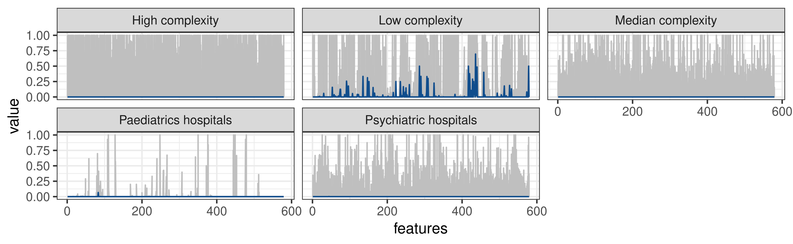
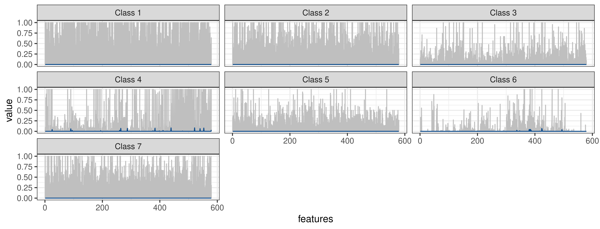

# JCC 2021

In this repository, you will find four different files:

- **CategorisationTable**: contains a table with the hospitals sorted according to MINSAL categorisations and proposed partitions, using Euclidean or Pearson's correlation distances.

- **Imgs01**: a figure that corresponds to the magnitude of the healthcare production features collected during 2016, grouped according to the modified MINSAL categorisation. The median values have been coloured blue. 

- **Imgs02**: a figure that corresponds to the magnitude of the healthcare production features collected during 2016, grouped according to consensus partition solution based on Pearson's correlation distance. The median values have been coloured blue. 

- **AppendixS1**: contains all the data mentioned above.